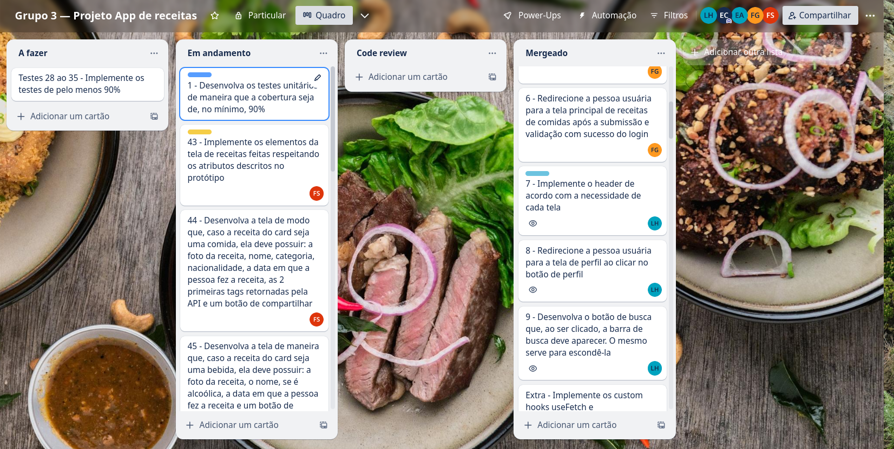

# Boas-vindas ao repositório do App de receitas Home-Chef!

 Neste projeto foi desenvolvido um app de receitas utilizando o que há de mais moderno dentro do ecossistema React: Hooks e Redux! 🚀

Nele, deverá ser possível: ver, buscar, filtrar, favoritar e acompanhar o progresso de preparação de receitas de comidas e bebidas!

A base de dados são duas APIs distintas: uma para comidas e outra para bebidas.

O layout tem como foco dispositivos móveis. Assim, todos os protótipos estarão desenvolvidos em telas menores. 


# Detalhes

<details>
  <summary><strong>👨‍💻 Desenvolvimento e Colaboradores</strong></summary><br />

  Este projeto foi realizado em equipe, aonde contei com a ajuda e colaboração de colegas muito capacitados. Tivemos a oportunidade de desenvolver nossas habilidades de trabalho em equipe e a metodologia ágil.
  Abaixo detalho qual foi a minha colaboração para este projeto, meus colegas e a Trybe, que nos forneceu o esqueleto do projeto já configurado para o desenvolvimento do mesmo, assim como as APIs utilizadas.

### O que desenvolvi:

#### Global

* Implementação dos custom hooks useFetch e useLocalStorage

#### Header

* Implementação do header de acordo com a necessidade de cada tela
* Redirecionamento da pessoa usuária para a tela de perfil ao clicar no botão de perfil
* Desenvolvimento do botão de busca que, ao ser clicado, a barra de busca aparece. O mesmo serve para escondê-la
* Implementação dos testes

#### Tela de detalhes de uma receita

* RecommendedRecipes.tsx: Implementação das recomendações. Para receitas de comida, a recomendação é de bebida, já para as receitas de bebida a recomendação é de comida.
* Implementação de um botão de compartilhar a receita. Ao clicar, o link da receita dentro do app é copiado para o clipboard e uma mensagem avisando que o link foi copiado aparece.
* Implementação de um botão de favoritar. Ao clicar, salva as receitas favoritas no localStorage na chave favoriteRecipes.
* Implementação do ícone do coração (favorito) de modo que: vem preenchido caso a receita esteja favoritada e "despreenchido" caso contrário, ao clicar o seu estado atual é alterado.
* Implementação dos testes

#### Tela de receita em progresso

* Desenvolvimento da tela com uma imagem da receita, um título, a categoria (em caso de comidas) e se é ou não alcoólico (em caso de bebidas), uma lista de ingredientes (com as quantidades e instruções necessárias).
* Implementação de um checkbox para cada item da lista de ingredientes. Ao clicar no checkbox de um ingrediente, o nome dele deve ser "riscado" da lista.
* Lógica de salvar o estado do progresso, que deve ser mantido caso a pessoa atualize a página ou volte para a mesma receita
* Lógica de favoritar e compartilhar a raceita
* Implementação do botão de finalizar receita (Finish Recipe) que é habilitado apenas quando todos os ingredientes estiverem "checkados" (marcados)
* Redirecionamento da pessoa usuária após ela clicar no botão de finalizar receita (Finish Recipe) para a página de receitas feitas.
* Implementação dos testes

### Meus colaboradores

* Felipe Brandão - https://github.com/bran-do
* Fabio Lessa - https://github.com/fblessa
* Emily Costa - https://github.com/ellyalvescosta
* Trybe (Instituição de ensino) - https://github.com/tryber

</details>

<details>
  <summary><strong> 📝 Habilidades trabalhadas</strong></summary><br />

* Utilização do Redux para gerenciar estado.
* Utilização da biblioteca React-Redux.
* Utilização do React Hook useState.
* Utilização do React Hook useEffect.
* Criação de Hooks customizados.

</details>

<details>
  <summary><strong>👥 Trello como ferramenta Kanban</strong></summary><br />

  Utilizamos o Trello para organizar nossas atividades e dividir as tarefas, seguindo um modelo Kanban.
  
  

</details>


# Orientações

<details>
  <summary><strong>🚀 Como rodar o Projeto</strong></summary><br />

1. Clone o repositório

* Use o comando: `git@github.com:linahsu/app-de-receitas-home-chef.git`.
* Entre na pasta do repositório que você acabou de clonar:
  * `cd app-de-receitas-home-chef`

2. Instale as dependências

* `npm install`

3. Inicialize o projeto

* `npm start`

</details>

<details>
  <summary><strong>🎛 Linter</strong></summary><br />

  Este projeto utiliza o ESLint para fazer a análise estática do código.

  Para rodar o linter localmente deste projeto, execute o comando a seguir:

  ```bash
  npm run lint
  npm run lint:styles
  ```

</details>

<details>
  <summary><strong>🛠 Testes</strong></summary><br />

  Para executar os testes execute o comando a seguir:

  ```bash
  npm run test
  ```
